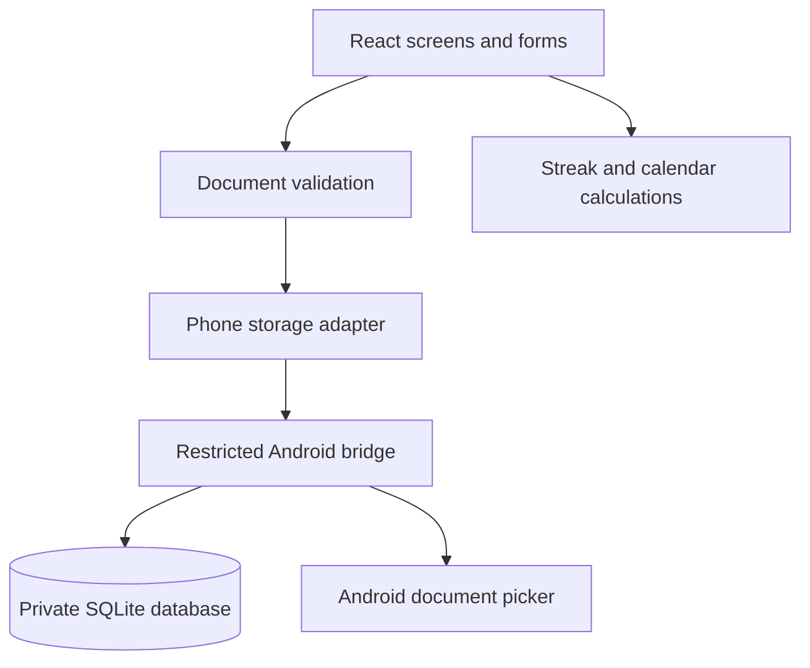

# Architecture

## Application structure

Momentum is a standalone Android application with a bundled React interface. `MainActivity` owns a single WebView that renders only local assets through `WebViewAssetLoader`. The screen never navigates to a hosted website or browser app.

## Modules

| Module | Responsibility |
|---|---|
| `src/components/Tracker.tsx` | Views, dialogs, filters, check-ins, settings, and exports |
| `src/lib/tracker.ts` | Date boundaries, schedules, streaks, metrics, and starter routines |
| `src/lib/validation.ts` | Document and backup constraints |
| `src/lib/migrations.ts` | Safe updates to unchanged starter labels |
| `src/platform/storage.ts` | Validated persistence calls and native backup export |
| `MainActivity.java` | Bundled content, system insets, Back, and document picker |
| `TrackerDatabase.java` | SQLite schema, transactions, and revision checks |

## Storage

The public SQLite row contains the validated tracker document and its revision. The document includes profile preferences, habits with effective-dated plans, entries keyed by habit/date, milestones, and saved weekly reviews. Updating the document occurs in a transaction. An unexpected revision rejects the write rather than silently overwriting newer state.

The UI reports success only after the transaction succeeds. Read failures preserve existing data and show an error; they never replace the database with an empty tracker. Schema upgrades must be additive. Starter-label migrations preserve habit identifiers, schedules, custom names, and existing entries.

Unsaved weekly reflections are stored separately in the app's local WebView storage. They survive reopening but are not included in JSON exports until the reflection is saved. Other open form edits should be saved before leaving the form.

## Offline and security boundaries

- The Android manifest does not request internet permission.
- All interface assets are bundled with the APK.
- Network loads, arbitrary navigation, file URLs, frames, and remote connections are blocked.
- The JavaScript bridge exposes public persistence, encrypted private persistence and unlock-attempt controls, private-screen protection, file export, and backgrounding.
- Release builds disable WebView debugging.
- Backups use Android's document picker; broad storage access is not requested.
- OS cloud backup is disabled; users manage exports themselves.
- SQLite lives in app-private storage. Public records remain plaintext within that sandbox; private records are separately encrypted with AES-GCM and Android Keystore protection. See [Private habits](PRIVATE_HABITS.md).
- Records and imports are capped at 2 MB and validated before persistence.

## Platform behavior

Android handles keyboard and system-bar insets. Back dismisses tracker dialogs, returns from secondary tabs to Today, then backgrounds the app. Configuration changes preserve the current Activity for ordinary rotation and size changes.

The app does not currently include reminders, home-screen widgets, health-platform integrations, or cross-device sync.
